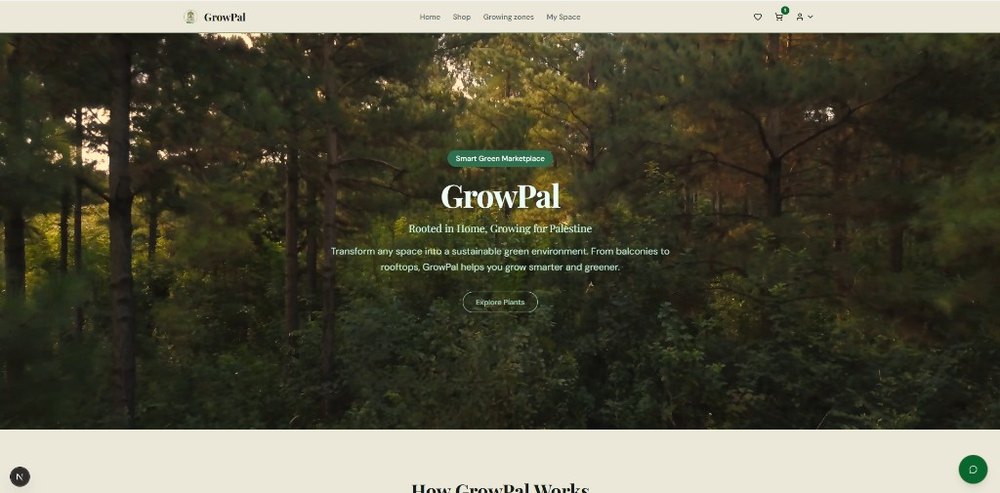
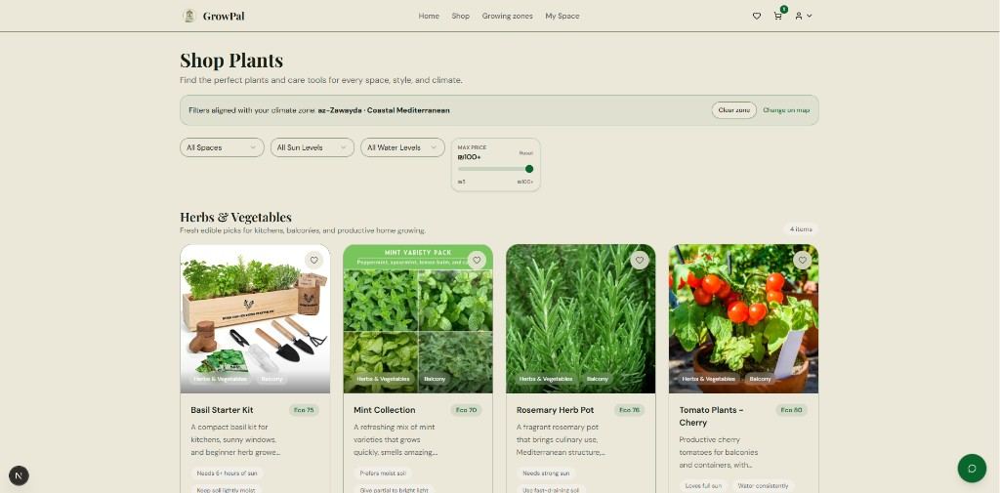
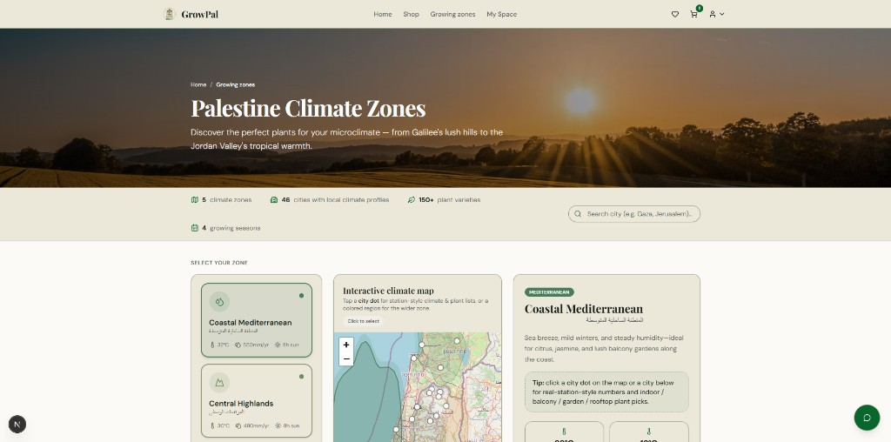

# GrowPal

**A full-stack platform for sustainable plant discovery, commerce, and space-aware gardening guidance.**

| | |
|---|---|
| **Repository** | [github.com/GrowPal-team/GrowPal](https://github.com/GrowPal-team/GrowPal) |
| **Stack** | Next.js (App Router), React 19, TypeScript, PHP, MySQL, Prisma |
| **Deployment** | Server-hosted application (not static hosting) |

---

## Abstract

GrowPal is a web application designed to support environmentally informed planting decisions. The system integrates product discovery, climate-zone recommendations, authenticated user flows, and checkout mechanics within a unified architecture. By combining a Next.js presentation layer with legacy PHP endpoints and a relational MySQL datastore, the platform delivers shop filtering, cart and wishlist management, discount validation, and post-purchase reward logic in a single cohesive product.

---

## 1. Introduction

Urban and residential greening initiatives often fail when plant selection ignores local climate, available space, and maintenance constraints. GrowPal addresses this gap by mapping user context—space type, sunlight, water requirements, and budget—to catalog items and zone-based suggestions, rather than relying on generic listings alone.

The application serves three primary user journeys:

1. **Discovery** — browse, filter, and compare plants aligned with environmental constraints;
2. **Commerce** — cart, wishlist, checkout, and promotional discount application;
3. **Engagement** — account management, email verification, and order-linked growth rewards.

---

## 2. System Architecture

| Layer | Technology | Role |
|--------|------------|------|
| Presentation | Next.js, React, TypeScript, Tailwind CSS | Routes, UI components, client logic |
| Application API | Next.js Route Handlers | REST-style endpoints for shop, auth bridge, checkout |
| Legacy services | PHP (`api/`, `includes/`) | Session auth, mail, shared server utilities |
| Persistence | MySQL via Prisma | Schema, queries, migrations |
| Messaging | PHPMailer | Transactional email (verification, reset) |

### 2.1 Directory layout

| Path | Description |
|------|-------------|
| `app/` | Next.js App Router pages and API routes |
| `components/` | Reusable React UI modules |
| `lib/` | Catalog, filters, discounts, mocks, shared helpers |
| `api/`, `includes/` | PHP backend and includes |
| `prisma/` | Database schema and client generation |
| `public/` | Static media (images, icons, video) |
| `docs/screenshots/` | Documentation figures (see §5) |

---

## 3. Functional Specification

| Capability | Summary |
|------------|---------|
| Smart shop | Category, space, sun exposure, water, and budget filters |
| Climate zones | Zone-based recommendations with curated imagery |
| Authentication | Registration, login, email verification, password reset |
| Cart & checkout | Line items, wishlist, discount codes, welcome offers |
| Rewards | Plant-growth logic triggered after completed orders |
| Administration | Expert and admin workspaces, user dashboard support |

---

## 4. Local Installation

### 4.1 Prerequisites

- Node.js and npm
- XAMPP (or equivalent PHP + MySQL stack)
- Composer (PHP dependencies)

### 4.2 Procedure

**Step 1 — Clone the repository**

```bash
git clone https://github.com/GrowPal-team/GrowPal.git
cd GrowPal
```

**Step 2 — Install dependencies**

```bash
npm install
composer install
```

**Step 3 — Configure environment**

Copy `.env.example` to `.env` and set values for the local database and mail subsystem:

| Variable | Purpose |
|----------|---------|
| `DATABASE_URL` | Prisma connection string |
| `DB_HOST`, `DB_PORT`, `DB_NAME` | MySQL connection |
| `DB_USERNAME`, `DB_PASSWORD` | Database credentials |
| `PHP_API_BASE_URL` | PHP API root URL |
| `GROWPAL_SITE_URL` | Public site base URL |
| `SESSION_SECRET` | Session signing |
| `GROWPAL_CODE_SECRET` | Reward / promo code signing |

**Step 4 — Initialise the database**

1. Create a MySQL database (e.g. `growpal_db`).
2. Import `database.sql` when starting from an empty schema.
3. Ensure PHP and Next.js reference the same database.
4. Generate the Prisma client:

```bash
npx prisma generate
```

**Step 5 — Optional data synchronisation**

```bash
npm run verify-db
npm run setup:reward-codes
npm run seed:shop
```

**Step 6 — Run locally**

Start Apache and MySQL, then:

```bash
npm run dev
```

| Service | URL |
|---------|-----|
| Next.js application | `http://localhost:3000` |
| PHP API base | `http://localhost/GrowPal/api` |

### 4.3 Deployment note

A **static preview** of the public Next.js UI (home, shop, climate zones, product pages, and marketing screens) is published via GitHub Pages at `https://growpal-team.github.io/GrowPal/`. That preview uses bundled demo catalog data; login, checkout, cart sync, and other API-backed flows require the full local stack. Rebuild the preview with `npm run build:pages` (output in `docs/`). Full production deployment should use a platform that supports Node.js, PHP (where required), and MySQL (e.g. Railway, Render, or comparable PaaS).

---

## 5. Illustrations

**Figure 1.** Home page — primary entry and navigation.



**Figure 2.** Shop — catalog and filter interface.



**Figure 3.** Climate zones — zone-based plant recommendations.



---

## 6. Development focus

The implementation emphasises:

- interface clarity and consistent interaction patterns;
- alignment between climate-zone logic and representative plant imagery;
- deterministic shop filtering behaviour;
- end-to-end authentication and checkout completeness;
- modular structure to preserve maintainability across PHP and TypeScript boundaries.

---

## 7. Repository and submission note

This GitHub repository reflects a **one-time upload** of the GrowPal project for academic submission. It is **not** set up for continuous development.

| Aspect | Status |
|--------|--------|
| **Branches** | A single `main` branch only. No feature, release, or long-lived collaborator branches are maintained. |
| **Ongoing work** | No active sprint cycle, issue board, or regular merge workflow is expected after submission. |
| **Commit history** | Preserved as a record of the delivered version, not as a living production pipeline. |
| **Future changes** | Any post-submission edits would be exceptional; reviewers should treat `main` as the submitted artefact. |

If you are evaluating the project for coursework or assessment, use the commit history and `main` branch as the complete deliverable. Do not expect the branching model or release practices of a continuously maintained open-source product.

---

## Document information

| Field | Value |
|-------|-------|
| Document type | Project README |
| Last revised | May 2026 |
